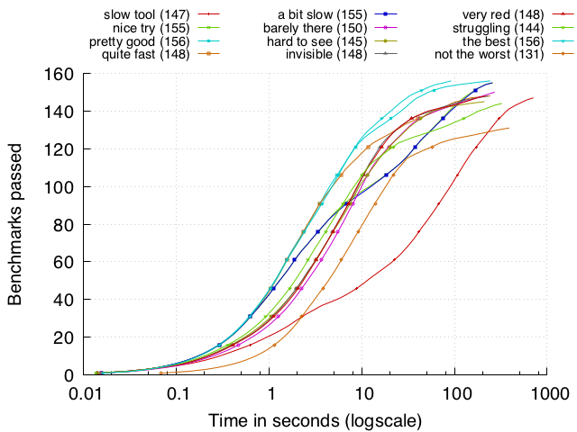
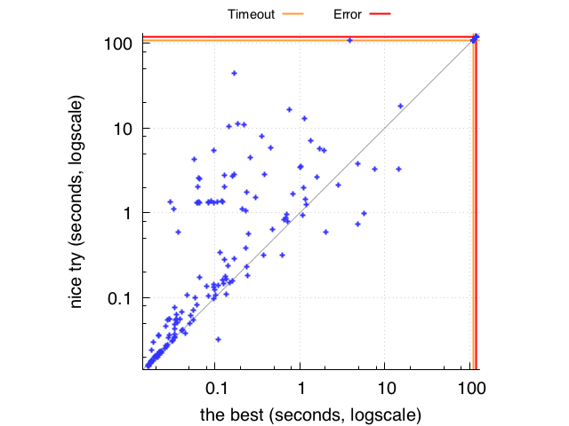

`benchi` is a benchmarking tool. It can benchmark some tools and inspect the results to generate [neat, paper-ready comparative graphs](#gallery) and other various metrics.

[](https://travis-ci.org/AdrienChampion/benchi)


# Features

Running:

- [x] dispatch benchmarks in parallel
- [x] for each benchmark dispatched, dispatch tools in parallel
- [x] log stdout of the tools, and stderr if non-empty
- [ ] retrieve and log user-defined data from runs (memory usage, something from the output, *etc.*)
- [ ] validate tool runs individually and against each other with user-defined validators (if any is provided)

Analyzing data:

- [x] cumulative plot of some or all of the tools
- [x] comparative plot of two of the tools
- [ ] customizable LaTeX `tabular` generation
- [ ] customizable markdown table generation
- [ ] interactive data exploration


# Build

Clone this repository, make sure you have a recent version of [rust](rust) installed and build with

```bash
cargo build --release
```

Your binary will be in `target/release/benchi`.


# Usage

The most up-to-date documentation is benchi's command-line help.

```bash
benchi help
```

To run benchmarks, you will need a simple configuration file documenting your tools and how to run them. Read about it with

```bash
benchi help conf
```

and generate a nice example with

```bash
benchi conf <file_name>
# Typically:
benchi conf example/test.conf
```

After creating the example configuration file, benchi will let you know about a few things you can do with it: running the "tools" it defines and generate plots of the results.

Running benchmarks is done through the `run` subcommand. Read more about it with

```bash
benchi help run
```


# Gallery

Here are the two kinds of graphs benchi can generate. The `gnuplot` file can be tweaked directly, there is currently no easy way to do it from benchi.

```bash
# To read more about plots:
benchi help plot
```

## Cumulative plot

```bash
# Learn about cumulative plot options:
benchi plot help cumul
```

In the keys, the number between parentheses is the number of benchmark passed.



## Comparative plot

```bash
# Comparative plot:
benchi plot help compare
```

Comparative between two runs. The timeout used during the runs was 100 seconds, notice that the timeout line is actually slightly above the real timeout value to distinguish timeouts from almost-timeouts.



[rust]: https://www.rust-lang.org/en-US/install.html (Install Rust)
